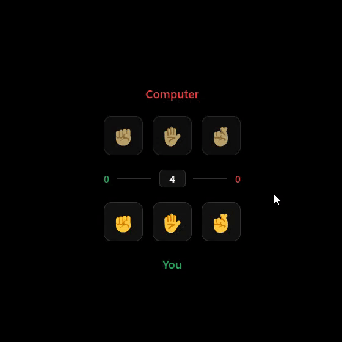

# Rock Paper Scissors

This project is a part of [The Odin Project's Foundations course](https://www.theodinproject.com/paths/foundations/courses/foundations).

> [Live Demo](https://lernywensi.github.io/rock-paper-scissors)

## About

This is an is a simple browser version of [Rock Paper Scissors](https://en.wikipedia.org/wiki/Rock_paper_scissors), a hand game usually played between two people, where each player simultaneously forms one of three shapes with an outstretched hand.

The rules are simple:

-   `Rock` beats `Scissors`
-   `Scissors` beats `Paper`
-   `Paper` beats `Rock`

> If both players choose the same shape, it's a tie.

## Built with

-   HTML
-   CSS
-   JavaScript

## Preview | [Live](https://lernywensi.github.io/rock-paper-scissors)

